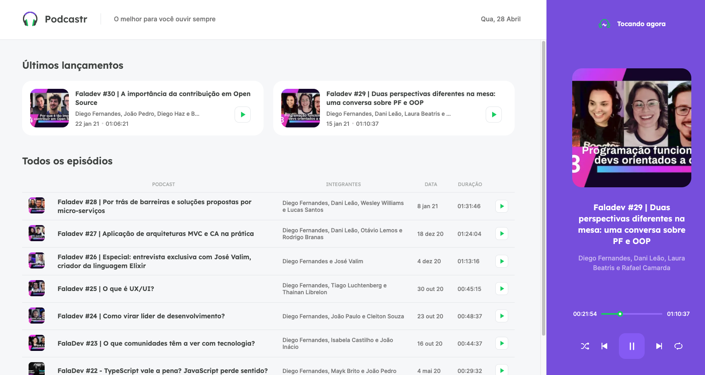

<h1 align="center">Podcaster | NLW</h1>

O Podcaster é um case realizado durante a imersão da NLW da Rocketseat.

O objetivo deste case é mergulhar nas tecnologias React, Next.js, TypeScript e Node.js e aprender conceitos, práticar a execução dessas tecnologias em um produto e entregar uma excelente experiência ao usuário

 

O Podcaster é uma aplicação que traz os melhores conteúdos da Rocketseat, de uma forma organizada, clara e objetiva para que alunos avancem em seus conhecimentos em tecnologia

<h1 align="center">
    <a href="https://pt-br.reactjs.org/">🔗 React</a>
<a href="https://nodejs.org/en/">🔗 Node.js</a>
<a href="https://nextjs.org/">🔗 Next.js</a>
<a href="https://www.typescriptlang.org/">🔗 TypeScript</a>
</h1>

 <a href="#tecnologias">Tecnologias</a> • 
 <a href="#autor">Autor</a>

<h4 align="center"> 
	🚧  Podcaster 🚀 em construção...  🚧
</h4>

###Features
- [x] Carregar podcasts (mock)
- [x] Escutar podcasts
- [x] Controlar execução dos podcasts
- [x] Controlar podcasts via teclado
- [ ] Aplicar darkmode
- [ ] Tornar a aplicação responsiva para mobile
- [ ] Carregar podcasts (servidor)

<h1 align="center">
  
</h1>

### 🛠 Tecnologias

As seguintes ferramentas foram usadas na construção do projeto:

- [React](https://pt-br.reactjs.org/)
- [Node.js](https://nodejs.org/en/)
- [Next.js](https://nextjs.org/)
- [TypeScript](https://www.typescriptlang.org/)

### Autor
---
<a href="https://www.linkedin.com/in/rafael-araujo-reis/">
 
  
 <b>Rafael Reis</b></a> <a href="https://www.linkedin.com/in/rafael-araujo-reis/" title="Linkedin">🚀</a>

Feito por Rafael Reis 👋🏽  Entre em contato!

 
